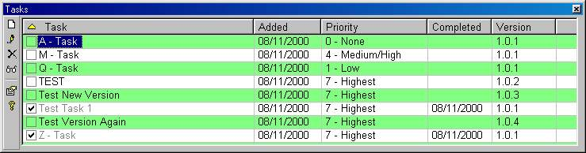



## Add\-In: Task List \- Update 2\.1\.4

### Description

Update to the VB 6 IDE Task List Add-in. This update's features are: 

<li>- Added: Column Priority

<li>- Added: Column Version (Default: hidden)

<li>- Modified: Column Added is now hidden (Default: hidden)

<li>- Added: New "Add Task" form

<li>- Modified: Double Click on TaskList will display menu instead of adding.

<li>- Added: Edit Task menu option (allows to edit the description only).

<li>- Added: Icons to Column headers to show current sort when clicked on.

<li>- Added: Save column widths

<li>- Added: Small toolbar on the left hand side

<li>- Added: Select Grid (alternating) colors.

  Thanks to B. Harriger (for v2.0) and the original author Mark Joyal

  Updates: 2.1.3

<li>- version set on completion (check) task

<li>- task list disabled until project is saved (prevent error messages).
 
### More Info
 

             |
---                |---
**Submitted On**   |2000-08-24 17:35:54
**By**             |[Pete Sral](https://github.com/Planet-Source-Code/PSCIndex/blob/master/ByAuthor/pete-sral.md)
**Level**          |Intermediate
**User Rating**    |4.7 (33 globes from 7 users)
**Compatibility**  |VB 6\.0
**Category**       |[OLE/ COM/ DCOM/ Active\-X](https://github.com/Planet-Source-Code/PSCIndex/blob/master/ByCategory/ole-com-dcom-active-x__1-29.md)
**World**          |[Visual Basic](https://github.com/Planet-Source-Code/PSCIndex/blob/master/ByWorld/visual-basic.md)
**Archive File**   |[CODE\_UPLOAD92898242000\.zip](https://github.com/Planet-Source-Code/pete-sral-add-in-task-list-update-2-1-4__1-10631/archive/master.zip)

